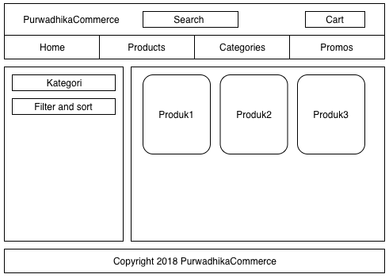
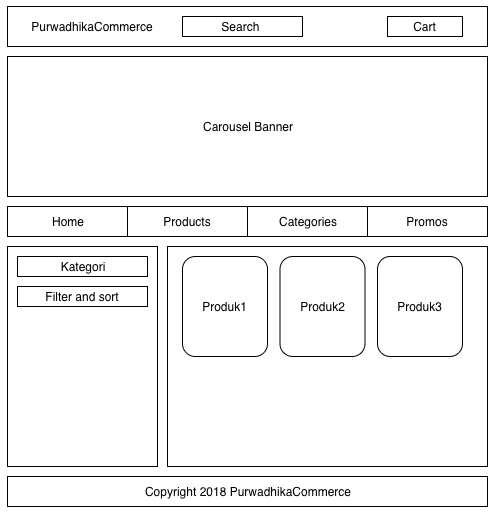

# purwadhika-commerce

## Installation

### Frontend (React)

#### Starting Project
```
cd frontend
create-react-app purwadhika-commerce
cd purwadhika-commerce
yarn start
```

#### Adding reactstrap dependencies
```
npm install --save bootstrap
npm install --save reactstrap
```

#### Adding components
1. Navbar
2. Carousel
3. Tab
4. Card

#### Starting Frontend (React)
```
cd frontend/purwadhika-commerce
npm start
```

### Frontend (Legacy)
```
npm i -g serve
serve frontend/legacy
serve backend -p 5004
```

## Development Setup
```
git clone https://github.com/<your_name>/purwadhika-commerce.git
cd purwadhika-commerce
git remote add upstream https://github.com/kemalelmizan/purwadhika-commerce.git
git pull upstream master
```

## Frontend

### Wireframe

#### Interasi 1
[](./docs/wireframe1.png)

#### Interasi 2
[](./docs/wireframe2.png)

## Todo List

1. [x] data produk
1. [x] wireframe product page
1. [x] develop front end untuk produk page

## Troubleshoot

### Reset to upstream

```
git reset --hard HEAD
git pull upstream master
```

### Create new branch, pull master from upstream
```
git checkout -b mybranch
git add .
git commit -m "my new branch"
git push origin mybranch
git checkout master
git pull upstream master
```